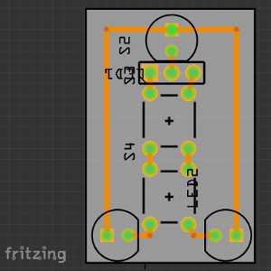
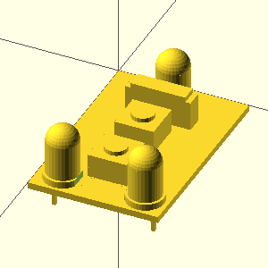
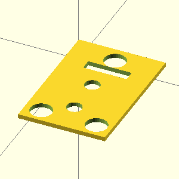

# fzz2scad-lib
The Library for fzz2scad.

# fzz2scad
Create a 3D Model/Frontplate (OpenSCAD) of/for the PCB in a Fritzing Sketch.

 |  | 
---------------------------------|---------------------------------|----------------------------------------

For an introduction to fzz2scad see [fzz2scad/README.md](https://github.com/htho/fzz2scad/blob/master/README.md).


# scadlib
A tool to create and manage libraries for OpenSCAD (with fzz2scad in mind).

For an introduction on how to use scadlib.py see [test/README.md](test/README.md).

# scaddoc
A specification proposal for a style to document scad (OpenSCAD) files.

To see the full specification-proposal take a look at [SCADDOC.md](SCADDOC.md)

Example:

```OpenSCAD
/**
 * A simple cube as a simple example.
 *
 * scaddoc provides a familiar method to annotate OpenSCAD modules,
 * functions, variables and files with meta data.
 *
 * @author John Doe <john@doe.net>
 */
module A(){
     cube(10);
}
/**
 * scaddoc also is mandatory in order to define and resolve
 * dependencies between entities (modules, functions, variables).
 *
 * @author John Doe <john@doe.net>
 * 
 * @module-dependency A a Cube.
 */
module B(){
    translate([10,0,0]) A();
}
```
